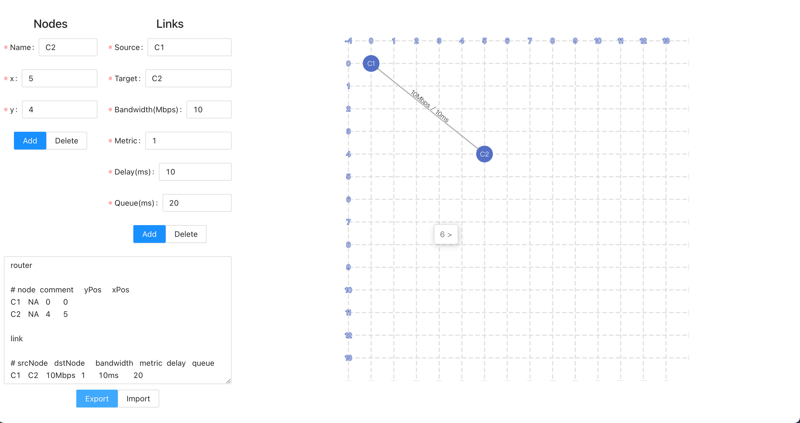

# ndnsim-topology generator

This is a easy ndnsim topology generator, You can use the graphical interface to simply generate the topology configuration required for ndnsim experimental test.

## Demo

Please visit [ndnsim topology generator (sunnyqjm.github.io)](https://sunnyqjm.github.io/ndnsim-topology/)



## Compile and Build yourself

```bash
git clone https://sunnyqjm.github.io/ndnsim-topology

cd ndnsim-topology
npm install
npm run start
```

